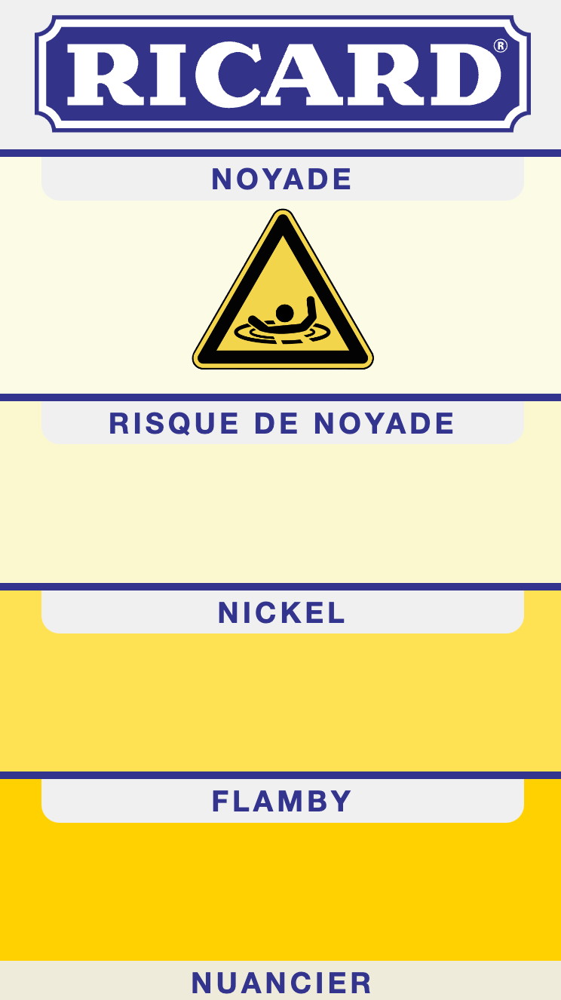

# NUANCIER RICARD

Ce projet a pour but d'afficher si notre ecran les supportes les couleurs en format P3

Pour ça on utilise une règle spécifique @supports (color: color(display-p3 1 1 1))

```
/* sRGB color. */
:root {
    --bright-green: rgb(0, 255, 0);
}

/* Display-P3 color, when supported. */
@supports (color: color(display-p3 1 1 1)) {
    :root {
        --bright-green: color(display-p3 0 1 0);
    }
}
```

## DISPLAY P3 - AUTOMATIZATION

Pour faire cela automatiquement on va installer postcss, mettre nos varables de couleur (rgb, hsl, hexa) dans un fichier css
celui ci va etre lu et utilisé pour creer un fichier similaire avec seulement les valeurs en P3

Les deux fichiers css vont etre importés dans main.tsx

```
import "./styles/variables.css";
import "./styles/variables-p3.css";
```

Voici le script npm que l'on va executer

```
"p3": "npx postcss ./src/styles/variables.css -u ../../translateToP3.js -o ./src/styles/variables-p3.css"
```

## PREVIEW


